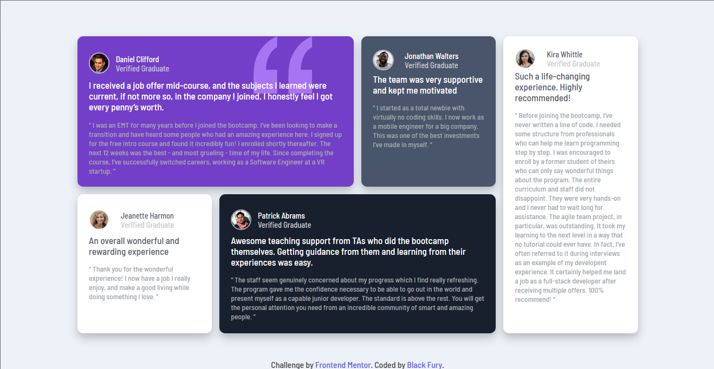

# Frontend Mentor | Testimonials-grid-section

This is a solution to the [Testimonials grid section challenge on Frontend Mentor](https://www.frontendmentor.io/solutions/build-a-testimonial-grid-section-using-html-css-flexbox-css-grid-OxYiDDlC3P). Frontend Mentor challenges help us improve our coding skills by building realistic projects.   

## Built with

- Semantic HTML5 markup
- CSS custom properties
- Flexbox
- CSS Grid
- Mobile-first workflow

Preview it here [Testimonials-grid-section](https://blackfury117.github.io/Testimonials-grid-section/)   

## Author

- Website - [Black Fury](https://blackfury117.github.io/)
- Frontend Mentor - [@BlackFury117](https://www.frontendmentor.io/profile/BlackFury117)
- Twitter - [@blackfury117](https://twitter.com/blackfury117)
